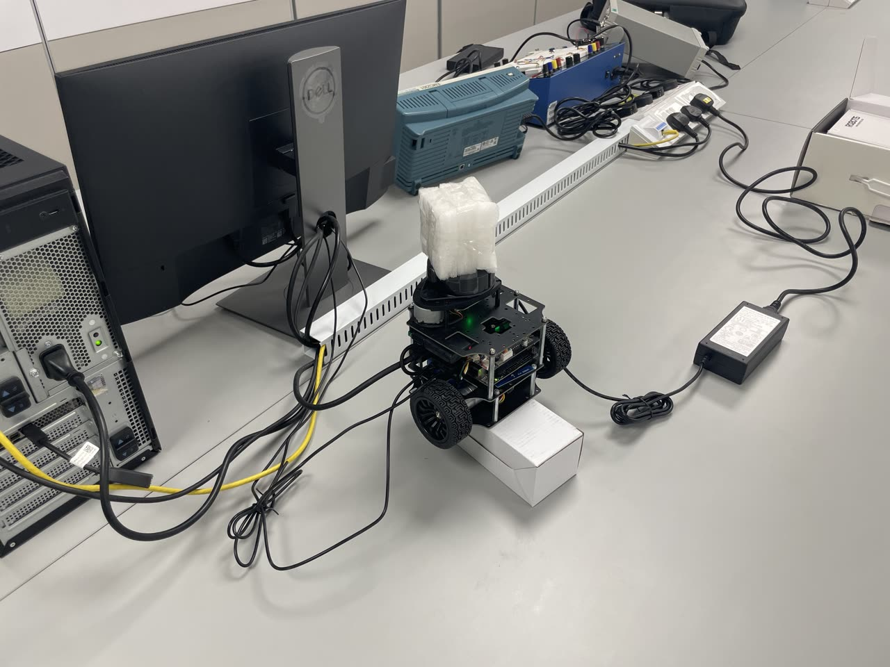
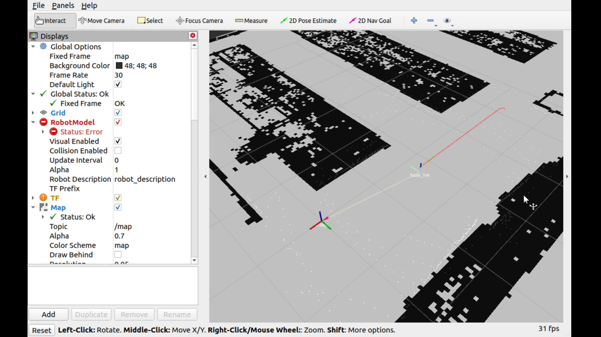
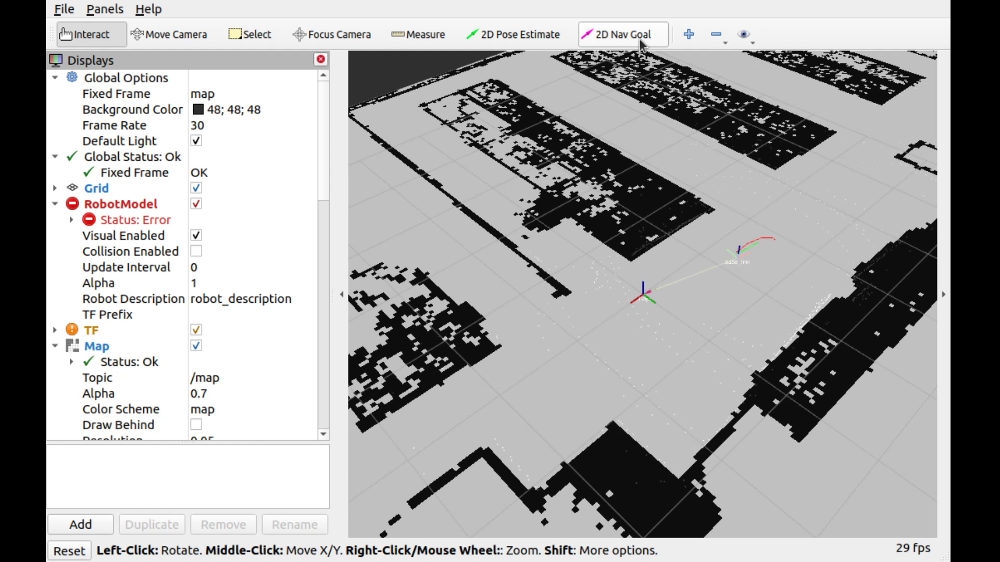
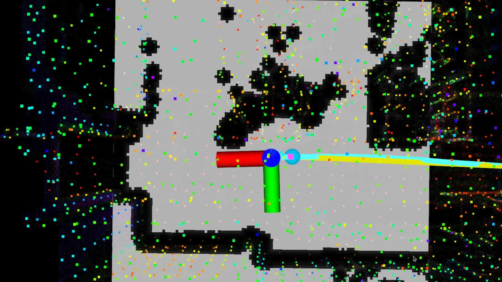
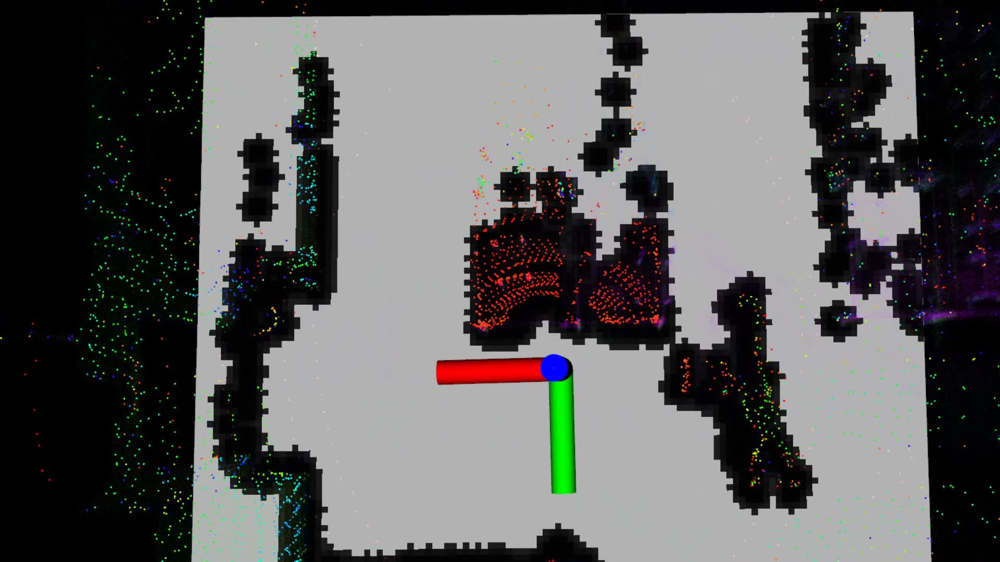
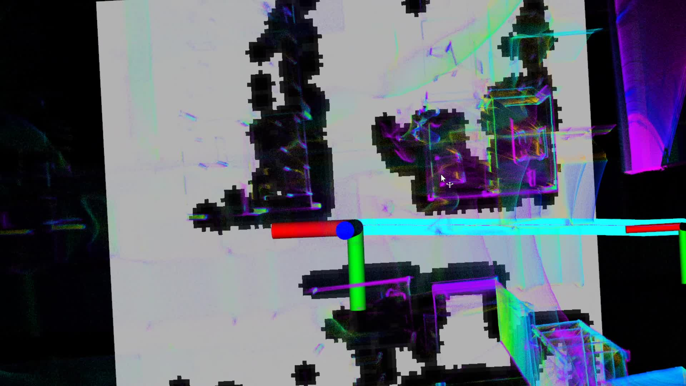
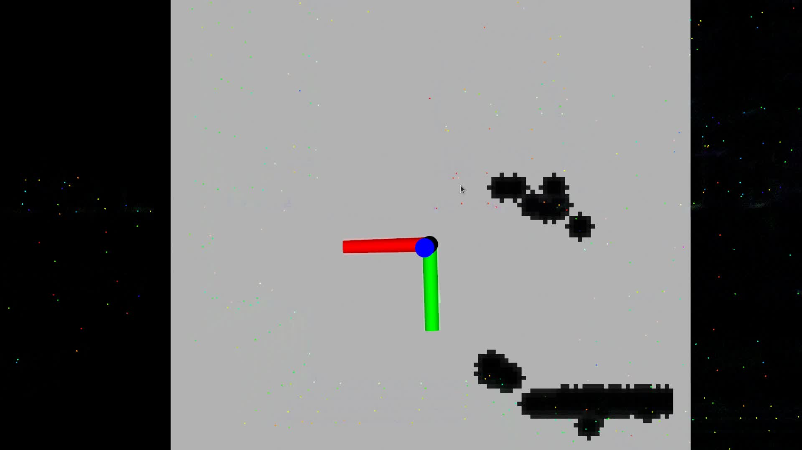

# SLAM Navigation Benchmark for a Livox MID360 Mobile Robot

This repository contains the curated code, evaluation scripts, and documentation for a National University of Singapore Final Year Project on **system-level benchmarking of LiDAR-inertial SLAM for real mobile robot navigation**.

The project integrates four SLAM backends into one shared ROS navigation stack:

- `LIO-SAM`
- `FAST-LIO`
- `Point-LIO`
- `FASTER-LIO`

The central idea is simple: keep the **robot, map, planner, costmap, and waypoint protocol fixed**, and study how different SLAM outputs change downstream navigation behaviour.

<p align="center">
  
</p>

## Project Focus

This project is not only about whether a SLAM algorithm can localize well in isolation. It asks a more practical robotics question:

> What happens when different LiDAR-inertial SLAM backends are connected to the same real navigation stack on the same robot?

To answer that, the project builds a unified benchmarking framework around:

- a differential-drive robot platform with a `Livox MID360`
- a shared ROS navigation stack based on `move_base`
- `DWAPlannerROS` for local planning
- `pointcloud_to_laserscan` for obstacle observation generation
- standardised offline and online evaluation pipelines

## What This Repository Contains

The repository combines three layers of work:

- **SLAM integration**
  - four LiDAR-inertial backends configured for the same robot platform
- **shared navigation**
  - one common odometry/cloud interface and one common navigation stack
- **evaluation and documentation**
  - scripts for rosbag evaluation, waypoint evaluation, report generation, and experiment notes

## Shared Navigation Interface

All four SLAM methods are connected to the same navigation pipeline through unified downstream topics:

- `/slam/odom`
- `/slam/cloud_registered`

This keeps the planner side fixed and makes the comparison more meaningful. Differences in navigation are then driven mainly by:

- odometry stability
- point-cloud representation
- frame conventions
- scan generation quality
- responsiveness of local obstacle updates

<p align="center">
  
</p>

## Benchmark Design

The benchmark contains two complementary parts.

### 1. Offline Static Rosbag Evaluation

Each SLAM backend is run on the same recorded rosbag to measure:

- trajectory consistency
- ATE / RPE
- CPU and memory usage
- per-frame processing characteristics

This isolates algorithm-side behaviour without planner interaction.

### 2. Online Navigation Evaluation

Each SLAM backend is then tested in the same live navigation framework with:

- the same map
- the same robot
- the same planner parameters
- the same waypoint routes
- the same obstacle interaction protocol

This reveals system-level differences such as:

- whether local costmaps update reliably
- whether dynamic obstacles are handled safely
- whether the robot reaches goals consistently
- whether behaviour is conservative, balanced, or overly aggressive

<p align="center">
  
</p>

## Representative Engineering Problems Addressed

The project also serves as an engineering study of integration problems that often decide whether a SLAM method is usable in navigation at all. Key issues addressed in this work include:

- TF-tree inconsistencies across heterogeneous SLAM packages
- incompatible odometry and registered-cloud topic conventions
- failure of local costmap updates even when SLAM itself appears correct
- instability caused by sparse or misframed cloud outputs
- rosbag recording that cannot support ATE/RPE because of missing reference odometry
- process cleanup problems that break repeated evaluation runs
- map export and 3D-to-2D occupancy map generation for navigation reuse

## Qualitative Demonstration Snapshots

The repository does not include the full archived navigation videos because they are too large for a clean GitHub code repository. Instead, selected representative frames are included here for qualitative inspection.

### Human-Interference Laboratory Demonstration

These frames are taken from the archived `lab_manual2` videos and show the four algorithms under a fixed human-interference protocol.

<p align="center">
  
  
</p>

<p align="center">
  
  
</p>

These are intended as visual demonstrations only. The full raw videos remain archived outside the repository because of file size constraints.

## Repository Layout

See [REPOSITORY_STRUCTURE.md](./REPOSITORY_STRUCTURE.md) for a fuller explanation. The main code structure is:

```text
.
├── docs/
├── ws_livox/
│   └── src/
│       ├── LIO-SAM-MID360/
│       ├── fyp_utils/
│       └── mid360_navigation/
├── fastlio2_ws/
│   └── src/
│       ├── FAST_LIO/
│       └── Point-LIO/
└── fasterlio_ws/
    └── src/
        └── faster-lio/
```

## Main Components

### `ws_livox/src/LIO-SAM-MID360`

Livox MID360-adapted `LIO-SAM` package used as one of the benchmarked SLAM backends.

### `fastlio2_ws/src/FAST_LIO`

`FAST-LIO` backend configured for the same robot and navigation interface.

### `fastlio2_ws/src/Point-LIO`

`Point-LIO` backend included in the comparison, with project-specific integration adjustments for fairer navigation benchmarking.

### `fasterlio_ws/src/faster-lio`

`FASTER-LIO` backend used as the fourth SLAM method.

### `ws_livox/src/mid360_navigation`

Shared navigation stack used by all four methods, including:

- `move_base`
- costmap configuration
- DWA planner parameters
- `pointcloud_to_laserscan`
- map-generation utilities

### `ws_livox/src/fyp_utils`

Project-specific evaluation and workflow tooling, including:

- rosbag recording helpers
- static SLAM evaluation scripts
- waypoint-based navigation evaluation scripts
- startup wrappers and monitoring tools

## Documentation Entry Points

For repository visitors, the easiest entry points are:

- [docs/README.md](./docs/README.md)
- [docs/notion_done/README.md](./docs/notion_done/README.md)
- [docs/reports/README.md](./docs/reports/README.md)
- [docs/waypoints/README.md](./docs/waypoints/README.md)

## Final Report

The current compiled project report is included here:

- [docs/reports/nus_fyp_report_english_20260405.pdf](./docs/reports/nus_fyp_report_english_20260405.pdf)

The README overview is aligned with the report content, but the report remains the authoritative project document.

## What Is Intentionally Excluded

To keep the repository code-focused and lightweight, the following are not included:

- large rosbags
- raw experiment videos
- large point-cloud map outputs such as `.pcd`
- generated navigation result archives
- build outputs such as `build/`, `devel/`, and log folders

## About the Videos

The archived `lab_manual2` folder does contain four algorithm demonstration videos. In principle, GitHub README pages can show videos, but for this repository that is not a good fit:

- `manual2_liosam/liosam.mkv` is about `862 MB`
- `manual2_fastlio/fastlio.mkv` is about `220 MB`
- `manual2_fasterlio/fasterlio.mkv` is about `242 MB`
- `manual2_pointlio/pointlio.mkv` is about `23 MB`

Because of that, this repository uses **video frames rather than full video files** in the README. This gives a much cleaner project homepage without turning the repository into a media archive.

## Acknowledgement

This project was developed as part of a Final Year Project at the National University of Singapore.
